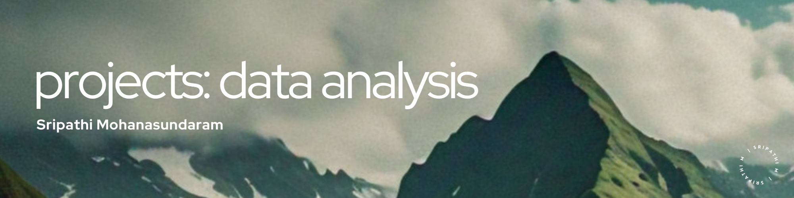

# Data Analytics Projects Repository
   

## Overview
Welcome to my repository of data analytics projects! This collection showcases my work in data exploration, analysis, and visualization, demonstrating my ability to extract valuable insights from complex datasets. Each project in this repository highlights my approach to solving real-world problems through data-driven decision-making.

## Project Showcase
Dive into a variety of projects, each focused on different aspects of data analytics, from data preprocessing and exploratory data analysis to predictive modeling and visual storytelling. Each project illustrates the powerful role of data in uncovering trends, patterns, and actionable insights.

- **Project 1: [Bad Passwords and the NIST Guidelines](https://github.com/microize/Projects_Data_Analytics/blob/master/01.da%3ABad%20passwords%20and%20the%20NIST%20guidelines.ipynb)**
  - An analysis of common passwords in the context of the National Institute of Standards and Technology (NIST) guidelines, assessing password strength and compliance.

- **Project 2: [Comparing Cosmetics by Ingredients](https://github.com/microize/Projects_Data_Analytics/blob/master/02.da%3AComparing%20Cosmetics%20by%20Ingredients.ipynb)**
  - A project comparing different cosmetic products based on their ingredients, exploring patterns and insights into product formulations and consumer preferences.

- **Project 3: [Disney Movies and Box Office Success](https://github.com/microize/Projects_Data_Analytics/blob/master/03.da%3ADisney%20Movies%20and%20Box%20Office%20Success.ipynb)**
  - Analyzes Disney movies to identify factors that contribute to box office success, examining trends across genres, release dates, and budgets.

- **Project 4: [Find Movie Similarity from Plot Summaries](https://github.com/microize/Projects_Data_Analytics/blob/master/04.da%3AFind%20Movie%20Similarity%20from%20Plot%20Summaries.ipynb)**
  - Utilizes natural language processing to analyze plot summaries and determine the similarity between movies, creating a model for movie recommendation.

- **Project 5: [Give Life: Predict Blood Donations](https://github.com/microize/Projects_Data_Analytics/blob/master/05.da%3AGive%20Life_%20Predict%20Blood%20Donations.ipynb)**
  - A predictive modeling project aimed at forecasting blood donations using donor data, with the goal of improving blood donation campaigns and inventory management.

- **Project 6: [Generating Keywords for Google Ads](https://github.com/microize/Projects_Data_Analytics/blob/master/06.da%3AGenerating%20Keywords%20for%20Google%20Ads.ipynb)**
  - Focuses on generating effective keywords for Google Ads campaigns using search data and keyword analytics, improving ad targeting and performance.

- **Project 7: [The Android App Market on Google Play](https://github.com/microize/Projects_Data_Analytics/blob/master/07.da%3AThe%20Android%20App%20Market%20on%20Google%20Play.ipynb)**
  - An analysis of the Android app market on Google Play, examining app categories, user ratings, and pricing models to uncover market trends and opportunities.

- **Project 8: [Word Frequency in Moby Dick](https://github.com/microize/Projects_Data_Analytics/blob/master/08.da%3AWord%20Frequency%20in%20Moby%20Dick.ipynb)**
  - A text analysis project that explores word frequency in the classic novel "Moby Dick," using natural language processing techniques to reveal linguistic patterns.

## About
This repository reflects my journey in the field of data analytics, where I combine statistical methods, machine learning techniques, and domain knowledge to solve complex problems. Each project showcases my proficiency in using data to drive decisions and my dedication to continuous learning and improvement.

## Usage
Feel free to explore the projects, review the code, and experiment with the data. Whether you're a data enthusiast, a professional analyst, or just curious, there's plenty of knowledge to gain here. If you find these projects helpful or interesting, please consider starring the repository!

## Contact
For further discussions on potential collaborations or to gain deeper insights into my projects, please feel free to contact me via email at [3sripathi@gmail.com](mailto:3sripathi@gmail.com). Additionally, you can explore more of my in-depth analyses and observations on machine learning on my [Medium blog](https://medium.com/@3sripathi) or connect with me on [LinkedIn](https://www.linkedin.com/in/sripathi-mohanasundaram/).
